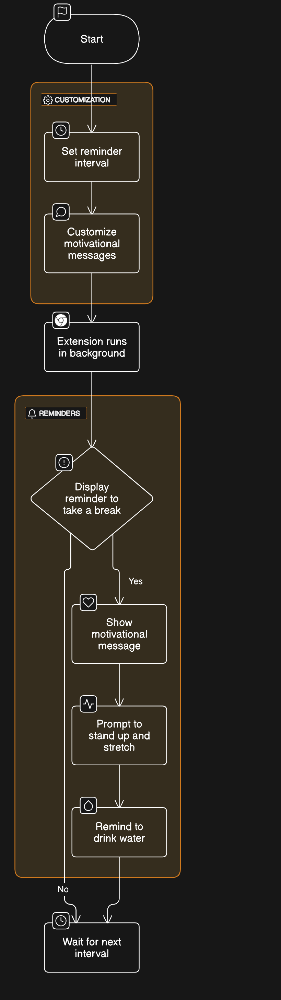

   
  <b>FlowMind</b>

Stay mindful and productive while browsing the web with the MindfulFlow Chrome Extension. This extension provides reminders to take breaks, stand up, and drink water at regular intervals to avoid prolonged sitting and stay hydrated.

## Features

- Set reminders at customizable intervals (30 minutes, 45 minutes, 1 hour, or a maximum of 2 hours).
- Display notifications with motivational messages to encourage breaks.
- Customize notification settings and messages.

## Installation

1. Download the extension files from the [GitHub repository](https://github.com/abhijeetkakade1234/mindfulflow).
2. Open Chrome and navigate to `chrome://extensions`.
3. Enable Developer mode.
4. Click on "Load unpacked" and select the extension directory.

## Usage

Once installed, the extension will run in the background. You can customize the reminder settings by clicking on the extension icon in the Chrome toolbar.

## Contributing

1. Fork the repository.
2. Create a new branch (`git checkout -b feature/yourfeature`).
3. Make your changes.
4. Commit your changes (`git commit -am 'Add new feature'`).
5. Push to the branch (`git push origin feature/yourfeature`).
6. Create a new Pull Request.

## License

This project is licensed under the MIT License - see the [LICENSE](LICENSE) file for details.

## Contact

For support or inquiries, please email us at abhijeetskakade04@gmail.com.

---

